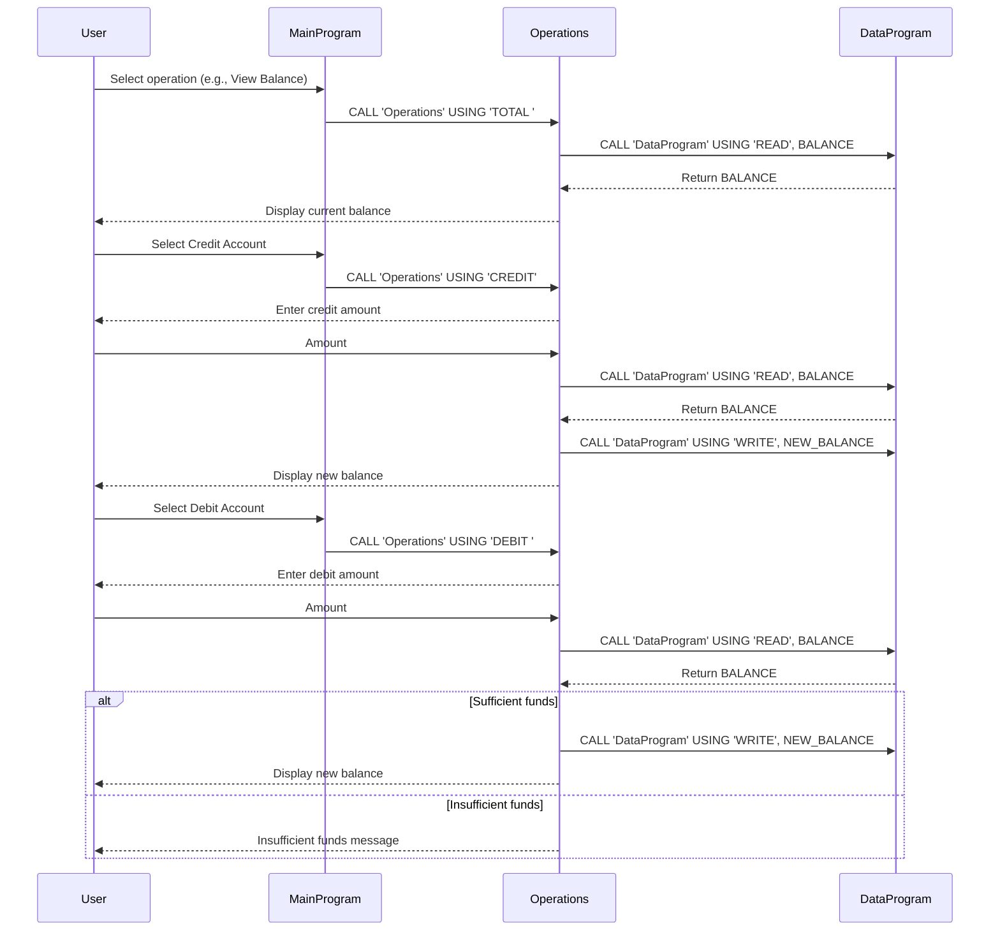

# COBOL Account Management System Documentation

## Overview
This COBOL system manages student account balances through a simple command-line interface. It allows viewing, crediting, and debiting account balances with basic validation.

## Files

### data.cob
**Purpose**: Handles storage and retrieval of account balance data. Acts as a data access layer for balance operations.

**Key Functions**:
- READ: Retrieves the current balance from storage.
- WRITE: Updates the balance in storage.

### main.cob
**Purpose**: Main entry point of the application, providing a menu-driven interface for user interactions.

**Key Functions**:
- Displays menu options for account management.
- Accepts user input and calls appropriate operations.
- Handles program exit.

### operations.cob
**Purpose**: Performs core account operations such as viewing balance, crediting, and debiting accounts.

**Key Functions**:
- TOTAL: Displays the current account balance.
- CREDIT: Adds a specified amount to the account balance.
- DEBIT: Subtracts a specified amount from the account balance, with validation.

## Business Rules Related to Student Accounts
- **Initial Balance**: Accounts start with a balance of 1000.00.
- **Debit Validation**: Debits are only allowed if the account has sufficient funds (balance >= debit amount). If insufficient, the transaction is rejected with an "Insufficient funds" message.
- **Balance Management**: All operations (credit/debit) update the persistent balance stored in data.cob.
- **Student Context**: Designed for managing financial accounts for students, ensuring basic financial controls like preventing overdrafts.

## Sequence Diagram

